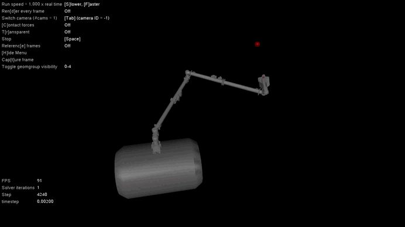

# TFG-Canadarm2
<p align="center">
  
</p>

Para poder utilizar este repositorio se recomienda instalar el entorno de conda "environment.yaml".
```bash
conda env create -f environment.yaml
```

El modelo del robot Canadarm2 se ha sacado del repositorio oficial de [Space ROS](https://github.com/space-ros/demos).

Los entornos de Frozen Lake y Pendulum se han descargado de la pagina oficial de [Gymnasium](https://github.com/space-ros/demos](https://gymnasium.farama.org/index.html)).

Por otro lado, los códigos del entrenamiento de estos dos entornos se han descargado de la pagina oficial de [skrl](https://skrl.readthedocs.io/en/latest/).
